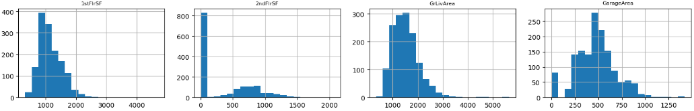
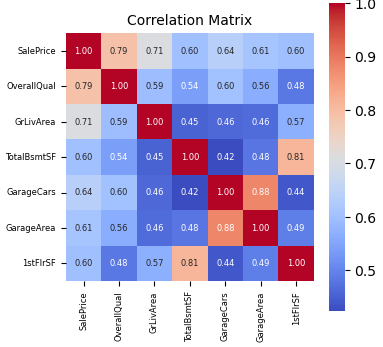
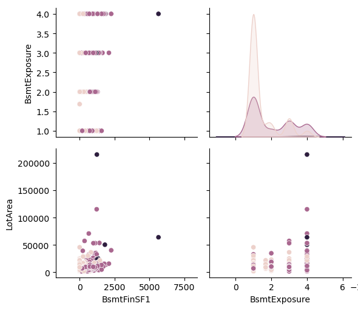
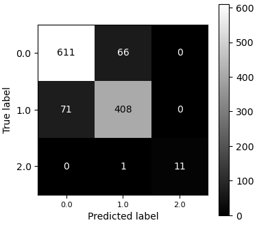
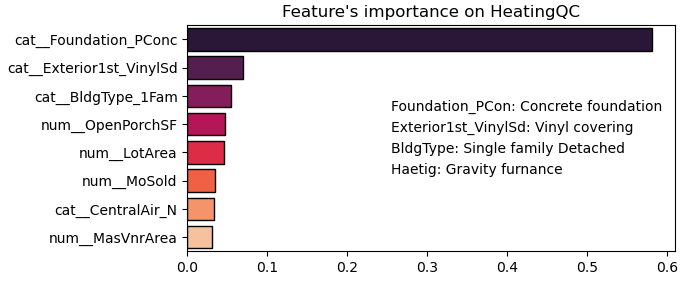

# **🏠 House Prices — End-to-End Machine Learning Project**

Author: Lorena Galvan – Data Scientist  
Problem Type: Supervised Regression  
Objective: Predict residential property sale prices using a house prices dataset from kaggle (https://www.kaggle.com/datasets/lespin/house-prices-dataset/data)

## **🚀 Project Overview**

This project implements a full end-to-end data science workflow, from raw data exploration to model evaluation and optimization. The goal is to build a robust regression model capable of accurately predicting house prices while demonstrating strong skills in:

- Advanced feature engineering

- Handling missing data systematically

- Statistical reasoning

- Models comparison and validation

- Regularization and generalization control

## 📈 What I Did
### Exploratory Data Analysis


The target variable (SalePrice) was right-skewed → log transformation improved normality. Strong correlations found with:

- OverallQual

- GrLivArea

- GarageCars
- Outliers in living area were detected and treated to stabilize variance
- #### Features, Target Distribution

- #### Correlation matrix of main features

- #### Selection of the categorical variable to analyze


### Model Performance

**🔹 Polynomial Regression 2nd grade**  

Results:  
- R²: 0.91  
- RMSE: $23,269  
- The model captured the main trend but showed sensitivity to outliers and non-linear effects.  


**🔹 Logistic Regression of the variable: Basement Full Bathroom**  

Results:  
- R²: 0.88  
- MAE: 0.12 (Variable takes the values: 0, 1, 2)  
- The model provided interpretable decision boundaries but was limited in capturing complex relationships.   
**Confusion Matrix**  



**🔹 Decision Tree**  

Results:  
- Train and Test Accuracy: 0.66, 0.62  
- Train and Test F1 weighted: 0.62, 0.56  
- The model improved predictive performance but required regularization to control overfitting.  
**Feature Importance**
  

## **🧠 Key Technical Highlights**
- **Exploratory Data Analysis (EDA)**

- Distribution of features analysis

- **Correlation analysis and multicollinearity analysis and correction**

- Outliers detection and treatment

## Feature Engineering

- Encoding of categorical variables

- **Missing value imputation pipelines**

- Log transformations for variance stabilization

- Feature scaling and normalization

## ⚙️ Modeling Strategy

- Regression models: Linear, Polynomial regression. Logistic Model. Decision Tree, Random Forest Classifier, Clustering Model.

- Regularized models (Ridge / Lasso / ElasticNet)

- Cross-validation 

- **Hyperparameter tuning**


## 📈 Evaluation

- **Evaluation metrics as RMSE, MAE, SD, Accuracy, F1 score**

## 🛠 Tech Stack

 - Python

- pandas / numpy

- matplotlib / seaborn

- scikit-learn

- Pipeline & Cross-Validation tools
- git, github

## 📂 Repository Structure
```
house-prices-regression/
│
├── README.md
├── data
│   ├── raw
├── notebooks
   └── house_prices_regression.ipynb
```
The notebook contains the complete workflow: data cleaning → feature engineering → modeling → evaluation.

## 🔎 How to Run

Clone the repository

Install dependencies

Open the notebook and run sequentially
